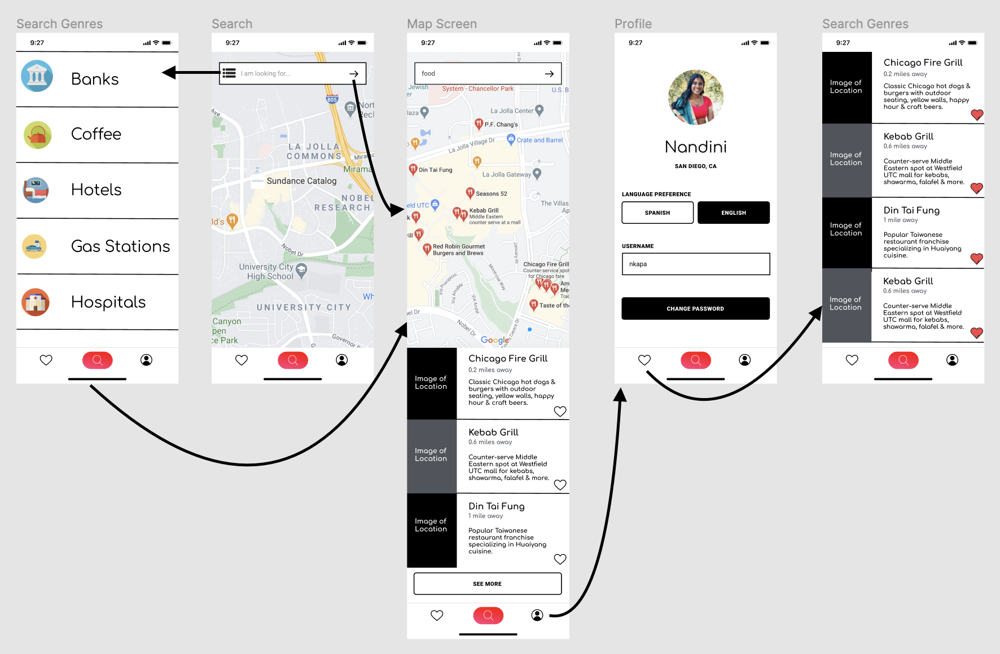

# FindIt

## Table of Contents
1. [Overview](#Overview)
2. [Product Spec](#Product-Spec)
3. [Wireframes](#Wireframes)
4. [Schema](#Schema)
5. [Development Progress](#Progress)

## Overview
### Description
The application allows users to quickly find various places near their current location based on either previously selected preferences, a certain category, name, or distance and display a detailed page with information on user-selected locations.

### App Evaluation
- **Category:** Lifestyle / Travel
- **Mobile:** This application will be primarily developed for mobile devices but can also be viable on computers, such as Yelp or other similar applications. The application intends to make use of the maps and location features of a mobile device.
- **Story:** Analyzes the user's location and connects the user to nearby locations that might peak their interest/current needs.
- **Market:** Any individual can choose to use this application.
- **Habit:** This application can be used as often as a users wants to depending on their need/desire to search for nearby locations.
- **Scope:** First we would ensure that a user can find locations of restaurants, entertainment, etc. that appear in a list (with a genre and address) based on their current location. Secondly, we would try to expand on the locatins find by providing more in-depth features that would allow users to inderatc with the locations found (i.e. directions, websites, contact information, etc.).

## Product Spec

### 1. User Stories (Required and Optional)

**Required Must-have Stories**

- [X] User can log in and sign up for an account.
- [ ] User can search for a location based on genre, name, search radius.
- [ ] User can click on the desired location for the address and a desription.
- [X] User settings page is accessible.
- [ ] User settings can be changed.
- [X] User can navigate between tabs.
- [ ] User can see found locations on map interface in comparison to user's current location.
- [ ] User can "favorite" specific locations to be saved and referenced later on another tab.

**Optional Nice-to-have Stories**

- [ ] User can click on the desired location for detailed desrciption/more information.
- [ ] User can change current location to reflect another desired zip code or city.

### 2. Screen Archetypes

* Login
  * Signs up or logs into account.
* Search Screen
  * Upon searching for location category, name, etc., map screen opens
* Map Screen
   * Displays user's search results on map and contains descriptive infromation below in a swipable list. Allows user to favorite specific locations.
* Profile Screen
  * Lets people confirm location, change language, or change password.
* Saved Screen
  * Lets people see locations they have favorited.
* Genre Screen
  * Lets people create a search from categories.

### 3. Navigation

**Tab Navigation** (Tab to Screen)

* Search
* Profile
* Settings
* Saved Locations
* Genre

**Flow Navigation** (Screen to Screen)

* Forced Log-in -> Account creation if no log in is available.
* Saved Locations -> Toggle saved locations.
* Search Screen -> allows for user input -> Jumps to Map Screen showing search results.
* Profile -> Text fields to be modified. 
* Settings -> Toggle settings.
* Genre -> Buttons to be selected -> Jumps to Map Screen showing search results.

## Digital Wireframes



## Schema 
[This section will be completed in Unit 9]

### Models
#### Favorited Location

   | Property      | Type     | Description |
   | ------------- | -------- | ------------|
   | author        | Pointer to User| image author |
   | name          | String   | name of the location
   | category      | String   | description to specify category of location |
   | address       | String   | address of the location |

### Networking
#### List of network requests by screen
* Saved Screen
   - Saved Locations Screen
      - (Read/GET) Query all saved locations where user is author
         ```swift
         let query = PFQuery(className:"Locations")
         query.whereKey("author", equalTo: currentUser)
         query.order(byDescending: "createdAt")
         query.findObjectsInBackground { (locations: [PFObject]?, error: Error?) in
            if let error = error { 
               print(error.localizedDescription)
            } else if let locations = locations {
               print("Successfully retrieved \(locations.count) locations.")
           // TODO: Do something with posts...
            }
         }
         ```
      - (Delete) Delete existing saved location
   - Search Screen
      - (Create/POST) Create a new search text object
      - (Read/GET) Query map object
   - Profile Screen
      - (Read/GET) Query logged in user object
      - (Update/PUT) Update user profile image
   - Map Screen
      - (Read/GET) Query location objects based on text search object and user's current location
      - (Read/GET) Saved location object (to cross match with location obejcts)
      - (Read/GET) Query map object
      - (Create/POST) Create a new saved location
   - Genre Screen
      - (Read/GET) Query genre objects (as list)
      
- [OPTIONAL: List endpoints if using existing API such as Yelp]

## Progress

### Week 7 Progress


### Week 8 Progress


